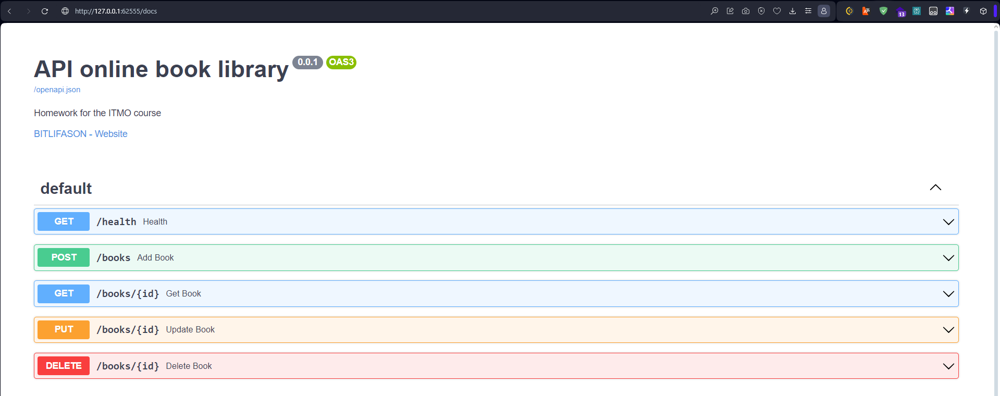

# Описание проекта

Разворачивание собственного сервиса "API online book library" на БД PostgreSQL. Init контейнер создаёт базу библиотеки. Используются кастомные образы для init контейнера для копирования скрипта инициализации базы (из-за трудностей с правами файлов при их монтировании в minikube на windows) и контейнера с приложением. У сервиса есть ручка "/health", на которую настроены Liveness и Readiness пробы.



# Запуск проекта

```bash
docker build -f init_db.Dockerfile -t bit/init-db:latest .
docker build -f app.Dockerfile -t bit/fastapi-app:latest .
minikube image load bit/init-db:latest
minikube image load bit/fastapi-app:latest
kubectl apply -f postgres.yml
kubectl apply -f app.yml
```
