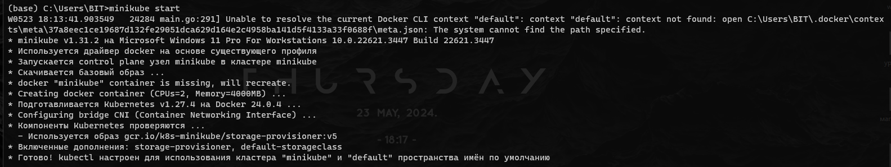
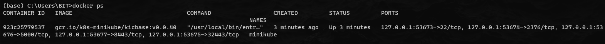
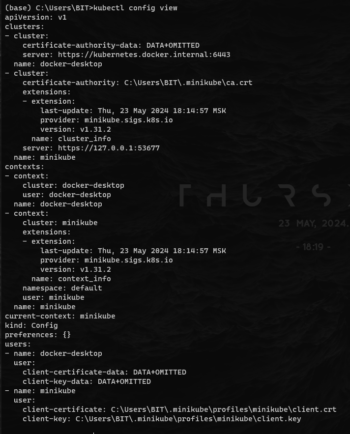
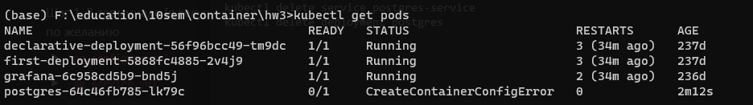
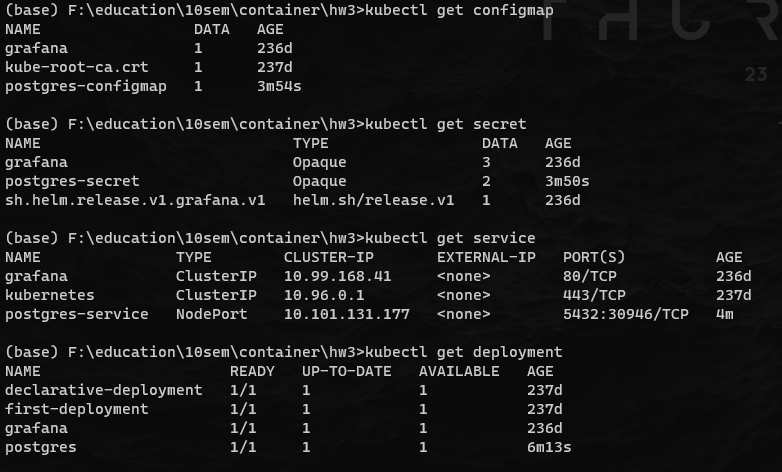
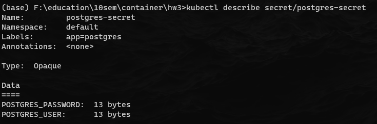
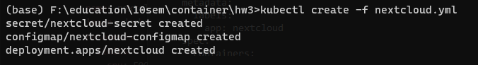
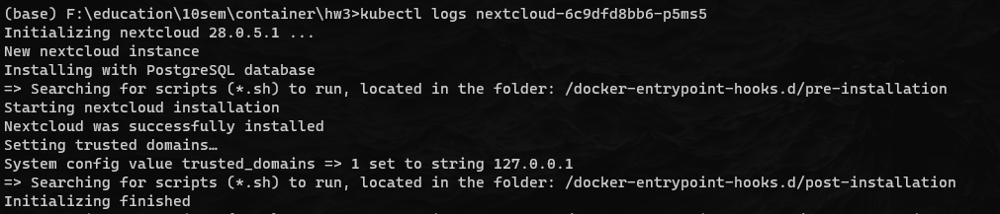

# Описание проекта

Разворачивание сервиса Nextcloud на БД PostgreSQL. Креды БД перенесены в её секреты. Все перменные среды Nextcloud перенесены в его отдельную конфигмапу. Для Nextcloud добавлены Liveness и Readness пробы проверяющие страницу авторизации.

# Запуск проекта

```bash
kubectl create -f pg_configmap.yml
kubectl create -f pg_secret.yml
kubectl create -f pg_service.yml
kubectl create -f pg_deployment.yml
kubectl create -f nextcloud.yml
```

# Ход работы








Скрин для первого вопроса:











# Ответы на вопросы

1) Важен ли порядок выполнения этих манифестов? Почему?

Принципиально не важен, но если деплоймент будет создан раньше, то он не будет готов и под будет создан со статусом ошибки (отсутствие секретов или конфигмапы), но когда они появятся деплоймент будет готов и под будет штатно запущен. Поэтому чтобы штатно разворачивать приложение сначала необходимо развернуть конфигурацию и сервисы, а потом уже деплоймент.

2) Что (и почему) произойдет, если отскейлить количество реплик postgres-deployment в 0, затем обратно в 1, после чего попробовать снова зайти на Nextcloud?

Если для postgres установить количество реплик равным 0, для удалится его под (так как репликасет увидит это значение и установит соответсвующее количество реплик) и nextcloud будет выдавать ошибку и пытаться постоянно установиться, но если вернуть под postgres, то nextcloud заново установит соединение и будет работать в штатном режиме. Однако если подобное сделать с nextcloud, то при попытке установиться в старую базу он будет выдавать ошибку доступа.
